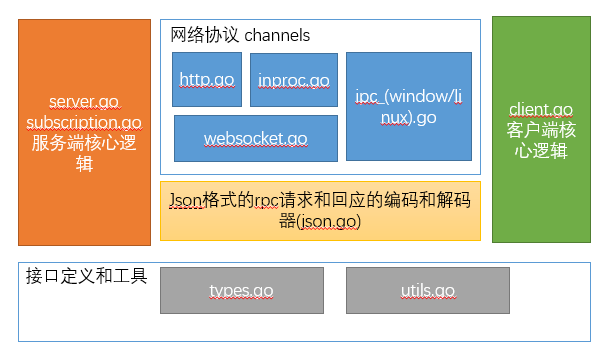
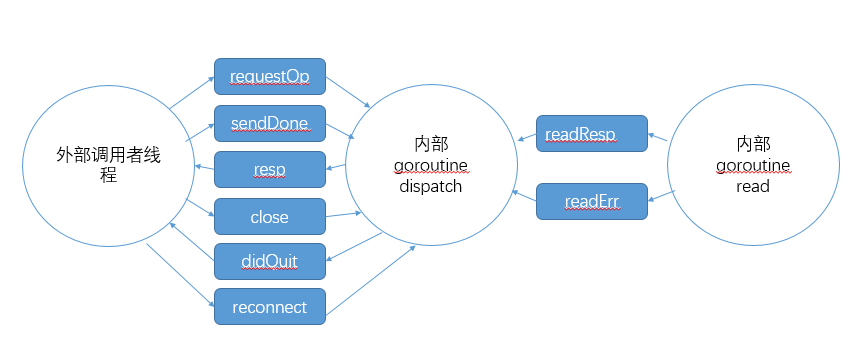

## RPC包的官方文档

Package rpc provides access to the exported methods of an object across a network
or other I/O connection. After creating a server instance objects can be registered,
making it visible from the outside. Exported methods that follow specific
conventions can be called remotely. It also has support for the publish/subscribe
pattern.

rpc包提供这样一种能力，可以通过网络或者其他I/O连接，可以访问对象被导出的方法。创建一个服务器之后，对象可以注册到服务器上，然后可以让外界访问。通过脂肪方式导出的方法可以被远程调用。 同时还支持发布/订阅模式。

Methods that satisfy the following criteria are made available for remote access:

- object must be exported
- method must be exported
- method returns 0, 1 (response or error) or 2 (response and error) values
- method argument(s) must be exported or builtin types
- method returned value(s) must be exported or builtin types

符合以下标准的方法可用于远程访问：

- 对象必须导出
- 方法必须导出
- 方法返回0，1（响应或错误）或2（响应和错误）值
- 方法参数必须导出或是内置类型
- 方法返回值必须导出或是内置类型

An example method:

	func (s *CalcService) Add(a, b int) (int, error)

When the returned error isn't nil the returned integer is ignored and the error is
send back to the client. Otherwise the returned integer is send back to the client.

当返回的error不等于nil的时候，返回的整形值被忽略，error被发送回客户端。 否则整形的会返回被发送回客户端。

Optional arguments are supported by accepting pointer values as arguments. E.g.
if we want to do the addition in an optional finite field we can accept a mod
argument as pointer value.
通过提供指针类型的参数可以使得方法支持可选参数。后面有点看不懂了。

	 func (s *CalService) Add(a, b int, mod *int) (int, error)

This RPC method can be called with 2 integers and a null value as third argument.
In that case the mod argument will be nil. Or it can be called with 3 integers,
in that case mod will be pointing to the given third argument. Since the optional
argument is the last argument the RPC package will also accept 2 integers as
arguments. It will pass the mod argument as nil to the RPC method.

RPC方法可以通过传两个integer和一个null值作为第三个参数来调用。在这种情况下mod参数会被设置为nil。或者可以传递三个integer,这样mod会被设置为指向第三个参数。尽管可选的参数是最后的参数，RPC包任然接收传递两个integer,这样mod参数会被设置为nil。

The server offers the ServeCodec method which accepts a ServerCodec instance. It will
read requests from the codec, process the request and sends the response back to the
client using the codec. The server can execute requests concurrently. Responses
can be sent back to the client out of order.

server提供了ServerCodec方法，这个方法接收ServerCodec实例作为参数。 服务器会使用codec读取请求，处理请求，然后通过codec发送回应给客户端。server可以并发的执行请求。response的顺序可能和request的顺序不一致。

	//An example server which uses the JSON codec:
	 type CalculatorService struct {}
	
	 func (s *CalculatorService) Add(a, b int) int {
		return a + b
	 }
	
	 func (s *CalculatorService Div(a, b int) (int, error) {
		if b == 0 {
			return 0, errors.New("divide by zero")
		}
		return a/b, nil
	 }
	calculator := new(CalculatorService)
	 server := NewServer()
	 server.RegisterName("calculator", calculator")
	
	 l, _ := net.ListenUnix("unix", &net.UnixAddr{Net: "unix", Name: "/tmp/calculator.sock"})
	 for {
		c, _ := l.AcceptUnix()
		codec := v2.NewJSONCodec(c)
		go server.ServeCodec(codec)
	 }


The package also supports the publish subscribe pattern through the use of subscriptions.
A method that is considered eligible for notifications must satisfy the following criteria:

 - object must be exported
 - method must be exported
 - first method argument type must be context.Context
 - method argument(s) must be exported or builtin types
 - method must return the tuple Subscription, error


该软件包还通过使用订阅来支持发布订阅模式。
被认为符合通知条件的方法必须满足以下条件：

- 对象必须导出
- 方法必须导出
- 第一个方法参数类型必须是context.Context
- 方法参数必须导出或内置类型
- 方法必须返回元组订阅，错误

An example method:

	 func (s *BlockChainService) NewBlocks(ctx context.Context) (Subscription, error) {
	 	...
	 }

Subscriptions are deleted when:

 - the user sends an unsubscribe request
 - the connection which was used to create the subscription is closed. This can be initiated
   by the client and server. The server will close the connection on an write error or when
   the queue of buffered notifications gets too big.

订阅在下面几种情况下会被删除

- 用户发送了一个取消订阅的请求
- 创建订阅的连接被关闭。这种情况可能由客户端或者服务器触发。 服务器在写入出错或者是通知队列长度太大的时候会选择关闭连接。

## RPC包的大致结构
网络协议 channels和Json格式的请求和回应的编码和解码都是同时与服务端和客户端打交道的类。网络协议channels主要提供连接和数据传输的功能。 json格式的编码和解码主要提供请求和回应的序列化和反序列化功能(Json -> Go的对象)。




## 源码解析

### server.go
server.go主要实现了RPC服务端的核心逻辑。 包括RPC方法的注册， 读取请求，处理请求，发送回应等逻辑。
server的核心数据结构是Server结构体。 services字段是一个map，记录了所有注册的方法和类。 run参数是用来控制Server的运行和停止的。 codecs是一个set。 用来存储所有的编码解码器，其实就是所有的连接。 codecsMu是用来保护多线程访问codecs的锁。

services字段的value类型是service类型。 service代表了一个注册到Server的实例，是一个对象和方法的组合。 service字段的name代表了service的namespace， typ实例的类型， callbacks是实例的回调方法， subscriptions是实例的订阅方法。


	type serviceRegistry map[string]*service // collection of services
	type callbacks map[string]*callback      // collection of RPC callbacks
	type subscriptions map[string]*callback 
	// Server is an RPC server.
	type Server struct {
	services serviceRegistry
	idgen    func() ID
	run      int32
	codecs   mapset.Set
}

Server的创建，Server创建的时候通过调用server.RegisterName把自己的实例注册上来，提供一些RPC服务的元信息。
		
	const MetadataApi = "rpc"
	// NewServer will create a new server instance with no registered handlers.
	func NewServer() *Server {
		server := &Server{
			services: make(serviceRegistry),
			codecs:   set.New(),
			run:      1,
		}
	
		// register a default service which will provide meta information about the RPC service such as the services and
		// methods it offers.
		rpcService := &RPCService{server}
		server.RegisterName(MetadataApi, rpcService)
	
		return server
	}

服务注册server.RegisterName，RegisterName方法会通过传入的参数来创建一个service对象，如过传入的rcvr实例没有找到任何合适的方法，那么会返回错误。 如果没有错误，就把创建的service实例加入serviceRegistry。会添加锁来控制这块逻辑如果重新会callback返回数据信息

```
func (r *serviceRegistry) registerName(name string, rcvr interface{}) error {
	rcvrVal := reflect.ValueOf(rcvr)
	if name == "" {
		return fmt.Errorf("no service name for type %s", rcvrVal.Type().String())
	}
	callbacks := suitableCallbacks(rcvrVal)
	if len(callbacks) == 0 {
		return fmt.Errorf("service %T doesn't have any suitable methods/subscriptions to expose", rcvr)
	}

	r.mu.Lock()
	defer r.mu.Unlock()
	if r.services == nil {
		r.services = make(map[string]service)
	}
	svc, ok := r.services[name]
	if !ok {
		svc = service{
			name:          name,
			callbacks:     make(map[string]*callback),
			subscriptions: make(map[string]*callback),
		}
		r.services[name] = svc
	}
	for name, cb := range callbacks {
		if cb.isSubscribe {
			svc.subscriptions[name] = cb
		} else {
			svc.callbacks[name] = cb
		}
	}
	return nil
}
```

通过反射信息找出合适的方法，suitableCallbacks，这个方法在utils.go里面。 这个方法会遍历这个类型的所有方法，找到适配RPC callback或者subscription callback类型标准的方法并返回。关于RPC的标准，请参考文档开头的RPC标准。
```

```

server启动和服务， server的启动和服务这里参考ipc.go中的一部分代码。可以看到每Accept()一个链接，就启动一个goroutine调用srv.ServeCodec来进行服务，这里也可以看出JsonCodec的功能，Codec类似于装饰器模式，在连接外面包了一层。Codec会放在后续来介绍，这里先简单了解一下。

	func (srv *Server) ServeListener(l net.Listener) error {
		for {
			conn, err := l.Accept()
			if err != nil {
				return err
			}
			log.Trace(fmt.Sprint("accepted conn", conn.RemoteAddr()))
			go srv.ServeCodec(NewJSONCodec(conn), OptionMethodInvocation|OptionSubscriptions)
		}
	}

ServeCodec, 这个方法很简单，提供了codec.Close的关闭功能。 serveRequest的第二个参数singleShot是控制长连接还是短连接的参数，如果singleShot为真，那么处理完一个请求之后会退出。 不过咱们的serveRequest方法是一个死循环，不遇到异常，或者客户端主动关闭，服务端是不会关闭的。 所以rpc提供的是长连接的功能。

	// ServeCodec reads incoming requests from codec, calls the appropriate callback and writes the
	// response back using the given codec. It will block until the codec is closed or the server is
	// stopped. In either case the codec is closed.
	func (s *Server) ServeCodec(codec ServerCodec, options CodecOption) {
		defer codec.Close()
		s.serveRequest(codec, false, options)
	}

我们的重磅方法终于出场，serveRequest 这个方法就是Server的主要处理流程。从codec读取请求，找到对应的方法并调用，然后把回应写入codec。

部分标准库的代码可以参考网上的使用教程， sync.WaitGroup 实现了一个信号量的功能。 Context实现上下文管理。
```
// serveSingleRequest reads and processes a single RPC request from the given codec. This
// is used to serve HTTP connections. Subscriptions and reverse calls are not allowed in
// this mode.
func (s *Server) serveSingleRequest(ctx context.Context, codec ServerCodec) {
	// Don't serve if server is stopped.
	if atomic.LoadInt32(&s.run) == 0 {
		return
	}

	h := newHandler(ctx, codec, s.idgen, &s.services)
	h.allowSubscribe = false
	defer h.close(io.EOF, nil)

	reqs, batch, err := codec.readBatch()
	if err != nil {
		if err != io.EOF {
			codec.writeJSON(ctx, errorMessage(&invalidMessageError{"parse error"}))
		}
		return
	}
	if batch {
		h.handleBatch(reqs)
	} else {
		h.handleMsg(reqs[0])
	}
}
```

exec和execBatch方法,调用s.handle方法对request进行处理。 

	// exec executes the given request and writes the result back using the codec.
	func (s *Server) exec(ctx context.Context, codec ServerCodec, req *serverRequest) {
		var response interface{}
		var callback func()
		if req.err != nil {
			response = codec.CreateErrorResponse(&req.id, req.err)
		} else {
			response, callback = s.handle(ctx, codec, req)
		}
	
		if err := codec.Write(response); err != nil {
			log.Error(fmt.Sprintf("%v\n", err))
			codec.Close()
		}
	
		// when request was a subscribe request this allows these subscriptions to be actived
		if callback != nil {
			callback()
		}
	}
	
	// execBatch executes the given requests and writes the result back using the codec.
	// It will only write the response back when the last request is processed.
	func (s *Server) execBatch(ctx context.Context, codec ServerCodec, requests []*serverRequest) {
		responses := make([]interface{}, len(requests))
		var callbacks []func()
		for i, req := range requests {
			if req.err != nil {
				responses[i] = codec.CreateErrorResponse(&req.id, req.err)
			} else {
				var callback func()
				if responses[i], callback = s.handle(ctx, codec, req); callback != nil {
					callbacks = append(callbacks, callback)
				}
			}
		}
	
		if err := codec.Write(responses); err != nil {
			log.Error(fmt.Sprintf("%v\n", err))
			codec.Close()
		}
	
		// when request holds one of more subscribe requests this allows these subscriptions to be activated
		for _, c := range callbacks {
			c()
		}
	}

handle方法，执行一个request，然后返回response
	
	// handle executes a request and returns the response from the callback.
	func (s *Server) handle(ctx context.Context, codec ServerCodec, req *serverRequest) (interface{}, func()) {
		if req.err != nil {
			return codec.CreateErrorResponse(&req.id, req.err), nil
		}
		//如果是取消订阅的消息。NotifierFromContext(ctx)获取之前我们存入ctx的notifier。
		if req.isUnsubscribe { // cancel subscription, first param must be the subscription id
			if len(req.args) >= 1 && req.args[0].Kind() == reflect.String {
				notifier, supported := NotifierFromContext(ctx)
				if !supported { // interface doesn't support subscriptions (e.g. http)
					return codec.CreateErrorResponse(&req.id, &callbackError{ErrNotificationsUnsupported.Error()}), nil
				}
	
				subid := ID(req.args[0].String())
				if err := notifier.unsubscribe(subid); err != nil {
					return codec.CreateErrorResponse(&req.id, &callbackError{err.Error()}), nil
				}
	
				return codec.CreateResponse(req.id, true), nil
			}
			return codec.CreateErrorResponse(&req.id, &invalidParamsError{"Expected subscription id as first argument"}), nil
		}
		//如果是订阅消息。 那么创建订阅。并激活订阅。
		if req.callb.isSubscribe {
			subid, err := s.createSubscription(ctx, codec, req)
			if err != nil {
				return codec.CreateErrorResponse(&req.id, &callbackError{err.Error()}), nil
			}
	
			// active the subscription after the sub id was successfully sent to the client
			activateSub := func() {
				notifier, _ := NotifierFromContext(ctx)
				notifier.activate(subid, req.svcname)
			}
	
			return codec.CreateResponse(req.id, subid), activateSub
		}
	
		// regular RPC call, prepare arguments
		if len(req.args) != len(req.callb.argTypes) {
			rpcErr := &invalidParamsError{fmt.Sprintf("%s%s%s expects %d parameters, got %d",
				req.svcname, serviceMethodSeparator, req.callb.method.Name,
				len(req.callb.argTypes), len(req.args))}
			return codec.CreateErrorResponse(&req.id, rpcErr), nil
		}
	
		arguments := []reflect.Value{req.callb.rcvr}
		if req.callb.hasCtx {
			arguments = append(arguments, reflect.ValueOf(ctx))
		}
		if len(req.args) > 0 {
			arguments = append(arguments, req.args...)
		}
		//调用提供的rpc方法，并获取reply
		// execute RPC method and return result
		reply := req.callb.method.Func.Call(arguments)
		if len(reply) == 0 {
			return codec.CreateResponse(req.id, nil), nil
		}
	
		if req.callb.errPos >= 0 { // test if method returned an error
			if !reply[req.callb.errPos].IsNil() {
				e := reply[req.callb.errPos].Interface().(error)
				res := codec.CreateErrorResponse(&req.id, &callbackError{e.Error()})
				return res, nil
			}
		}
		return codec.CreateResponse(req.id, reply[0].Interface()), nil
	}

### subscription.go 发布订阅模式。
在之前的server.go中就有出现了一些发布订阅模式的代码， 在这里集中阐述一下。

我们在serveRequest的代码中，就有这样的代码。 

	如果codec支持, 可以通过一个叫notifier的对象执行回调函数发送消息给客户端。
	他和codec/connection关系很紧密。 如果连接被关闭，那么notifier会关闭，并取消掉所有激活的订阅。
	// if the codec supports notification include a notifier that callbacks can use
	// to send notification to clients. It is thight to the codec/connection. If the
	// connection is closed the notifier will stop and cancels all active subscriptions.
	if options&OptionSubscriptions == OptionSubscriptions {
		ctx = context.WithValue(ctx, notifierKey{}, newNotifier(codec))
	}

在服务一个客户端连接时候，调用newNotifier方法创建了一个notifier对象存储到ctx中。可以观察到Notifier对象保存了codec的实例，也就是说Notifier对象保存了网络连接，用来在需要的时候发送数据。

	// newNotifier creates a new notifier that can be used to send subscription
	// notifications to the client.
	func newNotifier(codec ServerCodec) *Notifier {
		return &Notifier{
			codec:    codec,
			active:   make(map[ID]*Subscription),
			inactive: make(map[ID]*Subscription),
		}
	}

然后在handle方法中， 我们处理一类特殊的方法，这种方法被标识为isSubscribe. 调用createSubscription方法创建了了一个Subscription并调用notifier.activate方法存储到notifier的激活队列里面。 代码里面有一个技巧。 这个方法调用完成后并没有直接激活subscription，而是把激活部分的代码作为一个函数返回回去。然后在exec或者execBatch代码里面等待codec.CreateResponse(req.id, subid)这个response被发送给客户端之后被调用。避免客户端还没有收到subscription ID的时候就收到了subscription信息。

	if req.callb.isSubscribe {
		subid, err := s.createSubscription(ctx, codec, req)
		if err != nil {
			return codec.CreateErrorResponse(&req.id, &callbackError{err.Error()}), nil
		}

		// active the subscription after the sub id was successfully sent to the client
		activateSub := func() {
			notifier, _ := NotifierFromContext(ctx)
			notifier.activate(subid, req.svcname)
		}

		return codec.CreateResponse(req.id, subid), activateSub
	}

createSubscription方法会调用指定的注册上来的方法，并得到回应。

	// createSubscription will call the subscription callback and returns the subscription id or error.
	func (s *Server) createSubscription(ctx context.Context, c ServerCodec, req *serverRequest) (ID, error) {
		// subscription have as first argument the context following optional arguments
		args := []reflect.Value{req.callb.rcvr, reflect.ValueOf(ctx)}
		args = append(args, req.args...)
		reply := req.callb.method.Func.Call(args)
	
		if !reply[1].IsNil() { // subscription creation failed
			return "", reply[1].Interface().(error)
		}
	
		return reply[0].Interface().(*Subscription).ID, nil
	}

在来看看我们的activate方法，这个方法激活了subscription。 subscription在subscription ID被发送给客户端之后被激活，避免客户端还没有收到subscription ID的时候就收到了subscription信息。
	
	// activate enables a subscription. Until a subscription is enabled all
	// notifications are dropped. This method is called by the RPC server after
	// the subscription ID was sent to client. This prevents notifications being
	// send to the client before the subscription ID is send to the client.
	func (n *Notifier) activate(id ID, namespace string) {
		n.subMu.Lock()
		defer n.subMu.Unlock()
		if sub, found := n.inactive[id]; found {
			sub.namespace = namespace
			n.active[id] = sub
			delete(n.inactive, id)
		}
	}

我们再来看一个取消订阅的函数

	// unsubscribe a subscription.
	// If the subscription could not be found ErrSubscriptionNotFound is returned.
	func (n *Notifier) unsubscribe(id ID) error {
		n.subMu.Lock()
		defer n.subMu.Unlock()
		if s, found := n.active[id]; found {
			close(s.err)
			delete(n.active, id)
			return nil
		}
		return ErrSubscriptionNotFound
	}

最后是一个发送订阅的函数，调用这个函数把数据发送到客户端， 这个也比较简单。

	// Notify sends a notification to the client with the given data as payload.
	// If an error occurs the RPC connection is closed and the error is returned.
	func (n *Notifier) Notify(id ID, data interface{}) error {
		n.subMu.RLock()
		defer n.subMu.RUnlock()
	
		sub, active := n.active[id]
		if active {
			notification := n.codec.CreateNotification(string(id), sub.namespace, data)
			if err := n.codec.Write(notification); err != nil {
				n.codec.Close()
				return err
			}
		}
		return nil
	}


如何使用建议通过subscription_test.go的TestNotifications来查看完整的流程。

### client.go  RPC客户端源码分析。

客户端的主要功能是把请求发送到服务端，然后接收回应，再把回应传递给调用者。

客户端的数据结构

```

// Client represents a connection to an RPC server.
type Client struct {
	idgen    func() ID // for subscriptions
	isHTTP   bool      // connection type: http, ws or ipc
	services *serviceRegistry

	idCounter uint32

	// This function, if non-nil, is called when the connection is lost.
	reconnectFunc reconnectFunc

	// writeConn is used for writing to the connection on the caller's goroutine. It should
	// only be accessed outside of dispatch, with the write lock held. The write lock is
	// taken by sending on reqInit and released by sending on reqSent.
	writeConn jsonWriter

	// for dispatch
	close       chan struct{}
	closing     chan struct{}    // closed when client is quitting
	didClose    chan struct{}    // closed when client quits
	reconnected chan ServerCodec // where write/reconnect sends the new connection
	readOp      chan readOp      // read messages
	readErr     chan error       // errors from read
	reqInit     chan *requestOp  // register response IDs, takes write lock
	reqSent     chan error       // signals write completion, releases write lock
	reqTimeout  chan *requestOp  // removes response IDs when call timeout expires
}

```
newClient， 新建一个客户端。 通过调用connectFunc方法来获取一个网络连接，如果网络连接是httpConn对象的化，那么isHTTP设置为true。然后是对象的初始化， 如果是HTTP连接的化，直接返回，否者就启动一个goroutine调用dispatch方法。 dispatch方法是整个client的指挥中心，通过上面提到的channel来和其他的goroutine来进行通信，获取信息，根据信息做出各种决策。后续会详细介绍dispatch。 因为HTTP的调用方式非常简单， 这里先对HTTP的方式做一个简单的阐述。

```
func (c *Client) newClientConn(conn ServerCodec) *clientConn {
	ctx := context.Background()
	ctx = context.WithValue(ctx, clientContextKey{}, c)
	ctx = context.WithValue(ctx, peerInfoContextKey{}, conn.peerInfo())
	handler := newHandler(ctx, conn, c.idgen, c.services)
	return &clientConn{conn, handler}
}
```

请求调用通过调用client的 Call方法来进行RPC调用。

	// Call performs a JSON-RPC call with the given arguments and unmarshals into
	// result if no error occurred.
	//
	// The result must be a pointer so that package json can unmarshal into it. You
	// can also pass nil, in which case the result is ignored.
	返回值必须是一个指针，这样才能把json值转换成对象。 如果你不关心返回值，也可以通过传nil来忽略。
	func (c *Client) Call(result interface{}, method string, args ...interface{}) error {
		ctx := context.Background()
		return c.CallContext(ctx, result, method, args...)
	}
	
	func (c *Client) CallContext(ctx context.Context, result interface{}, method string, args ...interface{}) error {
		msg, err := c.newMessage(method, args...)
		if err != nil {
			return err
		}
		//构建了一个requestOp对象。 resp是读取返回的队列，队列的长度是1。
		op := &requestOp{ids: []json.RawMessage{msg.ID}, resp: make(chan *jsonrpcMessage, 1)}
		
		if c.isHTTP {
			err = c.sendHTTP(ctx, op, msg)
		} else {
			err = c.send(ctx, op, msg)
		}
		if err != nil {
			return err
		}
	
		// dispatch has accepted the request and will close the channel it when it quits.
		switch resp, err := op.wait(ctx); {
		case err != nil:
			return err
		case resp.Error != nil:
			return resp.Error
		case len(resp.Result) == 0:
			return ErrNoResult
		default:
			return json.Unmarshal(resp.Result, &result)
		}
	}

sendHTTP,这个方法直接调用doRequest方法进行请求拿到回应。然后写入到resp队列就返回了。

	func (c *Client) sendHTTP(ctx context.Context, op *requestOp, msg interface{}) error {
		hc := c.writeConn.(*httpConn)
		respBody, err := hc.doRequest(ctx, msg)
		if err != nil {
			return err
		}
		defer respBody.Close()
		var respmsg jsonrpcMessage
		if err := json.NewDecoder(respBody).Decode(&respmsg); err != nil {
			return err
		}
		op.resp <- &respmsg
		return nil
	}


在看看上面的另一个方法 op.wait()方法，这个方法会查看两个队列的信息。如果是http那么从resp队列获取到回应就会直接返回。 这样整个HTTP的请求过程就完成了。 中间没有涉及到多线程问题，都在一个线程内部完成了。

	func (op *requestOp) wait(ctx context.Context) (*jsonrpcMessage, error) {
		select {
		case <-ctx.Done():
			return nil, ctx.Err()
		case resp := <-op.resp:
			return resp, op.err
		}
	}

如果不是HTTP请求呢。 那处理的流程就比较复杂了， 还记得如果不是HTTP请求。在newClient的时候是启动了一个goroutine 调用了dispatch方法。 我们先看非http的 send方法。

从注释来看。 这个方法把op写入到requestOp这个队列，注意的是这个队列是没有缓冲区的，也就是说如果这个时候这个队列没有人处理的化，这个调用是会阻塞在这里的。 这就相当于一把锁，如果发送op到requestOp成功了就拿到了锁，可以继续下一步，下一步是调用write方法把请求的全部内容发送到网络上。然后发送消息给sendDone队列。sendDone可以看成是锁的释放，后续在dispatch方法里面会详细分析这个过程。 然后返回。返回之后方法会阻塞在op.wait方法里面。直到从op.resp队列收到一个回应，或者是收到一个ctx.Done()消息(这个消息一般会在完成或者是强制退出的时候获取到。)

	// send registers op with the dispatch loop, then sends msg on the connection.
	// if sending fails, op is deregistered.
	func (c *Client) send(ctx context.Context, op *requestOp, msg interface{}) error {
		select {
		case c.requestOp <- op:
			log.Trace("", "msg", log.Lazy{Fn: func() string {
				return fmt.Sprint("sending ", msg)
			}})
			err := c.write(ctx, msg)
			c.sendDone <- err
			return err
		case <-ctx.Done():
			// This can happen if the client is overloaded or unable to keep up with
			// subscription notifications.
			return ctx.Err()
		case <-c.didQuit:
			//已经退出，可能被调用了Close
			return ErrClientQuit
		}
	}

dispatch方法
	

	// dispatch is the main loop of the client.
	// It sends read messages to waiting calls to Call and BatchCall
	// and subscription notifications to registered subscriptions.
	func (c *Client) dispatch(conn net.Conn) {
		// Spawn the initial read loop.
		go c.read(conn)
	
		var (
			lastOp        *requestOp    // tracks last send operation
			requestOpLock = c.requestOp // nil while the send lock is held
			reading       = true        // if true, a read loop is running
		)
		defer close(c.didQuit)
		defer func() {
			c.closeRequestOps(ErrClientQuit)
			conn.Close()
			if reading {
				// Empty read channels until read is dead.
				for {
					select {
					case <-c.readResp:
					case <-c.readErr:
						return
					}
				}
			}
		}()
	
		for {
			select {
			case <-c.close:
				return
	
			// Read path.
			case batch := <-c.readResp:
				//读取到一个回应。调用相应的方法处理
				for _, msg := range batch {
					switch {
					case msg.isNotification():
						log.Trace("", "msg", log.Lazy{Fn: func() string {
							return fmt.Sprint("<-readResp: notification ", msg)
						}})
						c.handleNotification(msg)
					case msg.isResponse():
						log.Trace("", "msg", log.Lazy{Fn: func() string {
							return fmt.Sprint("<-readResp: response ", msg)
						}})
						c.handleResponse(msg)
					default:
						log.Debug("", "msg", log.Lazy{Fn: func() string {
							return fmt.Sprint("<-readResp: dropping weird message", msg)
						}})
						// TODO: maybe close
					}
				}
	
			case err := <-c.readErr:
				//接收到读取失败信息，这个是read线程传递过来的。
				log.Debug(fmt.Sprintf("<-readErr: %v", err))
				c.closeRequestOps(err)
				conn.Close()
				reading = false
	
			case newconn := <-c.reconnected:
				//接收到一个重连接信息
				log.Debug(fmt.Sprintf("<-reconnected: (reading=%t) %v", reading, conn.RemoteAddr()))
				if reading {
					//等待之前的连接读取完成。
					// Wait for the previous read loop to exit. This is a rare case.
					conn.Close()
					<-c.readErr
				}
				//开启阅读的goroutine
				go c.read(newconn)
				reading = true
				conn = newconn
	
			// Send path.
			case op := <-requestOpLock:
				// Stop listening for further send ops until the current one is done.
				//接收到一个requestOp消息，那么设置requestOpLock为空，
				//这个时候如果有其他人也希望发送op到requestOp，会因为没有人处理而阻塞。
				requestOpLock = nil
				lastOp = op
				//把这个op加入等待队列。
				for _, id := range op.ids {
					c.respWait[string(id)] = op
				}
	
			case err := <-c.sendDone:
				//当op的请求信息已经发送到网络上。会发送信息到sendDone。如果发送过程出错，那么err !=nil。
				if err != nil {
					// Remove response handlers for the last send. We remove those here
					// because the error is already handled in Call or BatchCall. When the
					// read loop goes down, it will signal all other current operations.
					//把所有的id从等待队列删除。
					for _, id := range lastOp.ids {
						delete(c.respWait, string(id))
					}
				}
				// Listen for send ops again.
				//重新开始处理requestOp的消息。
				requestOpLock = c.requestOp
				lastOp = nil
			}
		}
	}


下面通过下面这种图来说明dispatch的主要流程。下面图片中圆形是线程。 蓝色矩形是channel。 箭头代表了channel的数据流动方向。



- 多线程串行发送请求到网络上的流程 首先发送requestOp请求到dispatch获取到锁， 然后把请求信息写入到网络，然后发送sendDone信息到dispatch解除锁。 通过requestOp和sendDone这两个channel以及dispatch代码的配合完成了串行的发送请求到网络上的功能。
- 读取返回信息然后返回给调用者的流程。 把请求信息发送到网络上之后， 内部的goroutine read会持续不断的从网络上读取信息。 read读取到返回信息之后，通过readResp队列发送给dispatch。 dispatch查找到对应的调用者，然后把返回信息写入调用者的resp队列中。完成返回信息的流程。
- 重连接流程。 重连接在外部调用者写入失败的情况下被外部调用者主动调用。 调用完成后发送新的连接给dispatch。 dispatch收到新的连接之后，会终止之前的连接，然后启动新的read goroutine来从新的连接上读取信息。
- 关闭流程。 调用者调用Close方法，Close方法会写入信息到close队列。 dispatch接收到close信息之后。 关闭didQuit队列，关闭连接，等待read goroutine停止。 所有等待在didQuit队列上面的客户端调用全部返回。


#### 客户端 订阅模式的特殊处理
上面提到的主要流程是方法调用的流程。 以太坊的RPC框架还支持发布和订阅的模式。 

我们先看看订阅的方法，以太坊提供了几种主要service的订阅方式(EthSubscribe ShhSubscribe).同时也提供了自定义服务的订阅方法(Subscribe)，


	// EthSubscribe registers a subscripion under the "eth" namespace.
	func (c *Client) EthSubscribe(ctx context.Context, channel interface{}, args ...interface{}) (*ClientSubscription, error) {
		return c.Subscribe(ctx, "eth", channel, args...)
	}
	
	// ShhSubscribe registers a subscripion under the "shh" namespace.
	func (c *Client) ShhSubscribe(ctx context.Context, channel interface{}, args ...interface{}) (*ClientSubscription, error) {
		return c.Subscribe(ctx, "shh", channel, args...)
	}
	
	// Subscribe calls the "<namespace>_subscribe" method with the given arguments,
	// registering a subscription. Server notifications for the subscription are
	// sent to the given channel. The element type of the channel must match the
	// expected type of content returned by the subscription.
	//
	// The context argument cancels the RPC request that sets up the subscription but has no
	// effect on the subscription after Subscribe has returned.
	//
	// Slow subscribers will be dropped eventually. Client buffers up to 8000 notifications
	// before considering the subscriber dead. The subscription Err channel will receive
	// ErrSubscriptionQueueOverflow. Use a sufficiently large buffer on the channel or ensure
	// that the channel usually has at least one reader to prevent this issue.
	//Subscribe会使用传入的参数调用"<namespace>_subscribe"方法来订阅指定的消息。 
	//服务器的通知会写入channel参数指定的队列。 channel参数必须和返回的类型相同。 
	//ctx参数可以用来取消RPC的请求，但是如果订阅已经完成就不会有效果了。 
	//处理速度太慢的订阅者的消息会被删除，每个客户端有8000个消息的缓存。
	func (c *Client) Subscribe(ctx context.Context, namespace string, channel interface{}, args ...interface{}) (*ClientSubscription, error) {
		// Check type of channel first.
		chanVal := reflect.ValueOf(channel)
		if chanVal.Kind() != reflect.Chan || chanVal.Type().ChanDir()&reflect.SendDir == 0 {
			panic("first argument to Subscribe must be a writable channel")
		}
		if chanVal.IsNil() {
			panic("channel given to Subscribe must not be nil")
		}
		if c.isHTTP {
			return nil, ErrNotificationsUnsupported
		}
	
		msg, err := c.newMessage(namespace+subscribeMethodSuffix, args...)
		if err != nil {
			return nil, err
		}
		//requestOp的参数和Call调用的不一样。 多了一个参数sub.
		op := &requestOp{
			ids:  []json.RawMessage{msg.ID},
			resp: make(chan *jsonrpcMessage),
			sub:  newClientSubscription(c, namespace, chanVal),
		}
	
		// Send the subscription request.
		// The arrival and validity of the response is signaled on sub.quit.
		if err := c.send(ctx, op, msg); err != nil {
			return nil, err
		}
		if _, err := op.wait(ctx); err != nil {
			return nil, err
		}
		return op.sub, nil
	}

newClientSubscription方法，这个方法创建了一个新的对象ClientSubscription，这个对象把传入的channel参数保存起来。 然后自己又创建了三个chan对象。后续会对详细介绍这三个chan对象


	func newClientSubscription(c *Client, namespace string, channel reflect.Value) *ClientSubscription {
		sub := &ClientSubscription{
			client:    c,
			namespace: namespace,
			etype:     channel.Type().Elem(),
			channel:   channel,
			quit:      make(chan struct{}),
			err:       make(chan error, 1),
			in:        make(chan json.RawMessage),
		}
		return sub
	}

从上面的代码可以看出。订阅过程根Call过程差不多，构建一个订阅请求。调用send发送到网络上，然后等待返回。 我们通过dispatch对返回结果的处理来看看订阅和Call的不同。


	func (c *Client) handleResponse(msg *jsonrpcMessage) {
		op := c.respWait[string(msg.ID)]
		if op == nil {
			log.Debug(fmt.Sprintf("unsolicited response %v", msg))
			return
		}
		delete(c.respWait, string(msg.ID))
		// For normal responses, just forward the reply to Call/BatchCall.
		如果op.sub是nil，普通的RPC请求，这个字段的值是空白的，只有订阅请求才有值。
		if op.sub == nil {
			op.resp <- msg
			return
		}
		// For subscription responses, start the subscription if the server
		// indicates success. EthSubscribe gets unblocked in either case through
		// the op.resp channel.
		defer close(op.resp)
		if msg.Error != nil {
			op.err = msg.Error
			return
		}
		if op.err = json.Unmarshal(msg.Result, &op.sub.subid); op.err == nil {
			//启动一个新的goroutine 并把op.sub.subid记录起来。
			go op.sub.start()
			c.subs[op.sub.subid] = op.sub
		}
	}


op.sub.start方法。 这个goroutine专门用来处理订阅消息。主要的功能是从in队列里面获取订阅消息，然后把订阅消息放到buffer里面。 如果能够数据能够发送。就从buffer里面发送一些数据给用户传入的那个channel。 如果buffer超过指定的大小，就丢弃。

	
	func (sub *ClientSubscription) start() {
		sub.quitWithError(sub.forward())
	}
	
	func (sub *ClientSubscription) forward() (err error, unsubscribeServer bool) {
		cases := []reflect.SelectCase{
			{Dir: reflect.SelectRecv, Chan: reflect.ValueOf(sub.quit)},
			{Dir: reflect.SelectRecv, Chan: reflect.ValueOf(sub.in)},
			{Dir: reflect.SelectSend, Chan: sub.channel},
		}
		buffer := list.New()
		defer buffer.Init()
		for {
			var chosen int
			var recv reflect.Value
			if buffer.Len() == 0 {
				// Idle, omit send case.
				chosen, recv, _ = reflect.Select(cases[:2])
			} else {
				// Non-empty buffer, send the first queued item.
				cases[2].Send = reflect.ValueOf(buffer.Front().Value)
				chosen, recv, _ = reflect.Select(cases)
			}
	
			switch chosen {
			case 0: // <-sub.quit
				return nil, false
			case 1: // <-sub.in
				val, err := sub.unmarshal(recv.Interface().(json.RawMessage))
				if err != nil {
					return err, true
				}
				if buffer.Len() == maxClientSubscriptionBuffer {
					return ErrSubscriptionQueueOverflow, true
				}
				buffer.PushBack(val)
			case 2: // sub.channel<-
				cases[2].Send = reflect.Value{} // Don't hold onto the value.
				buffer.Remove(buffer.Front())
			}
		}
	}


当接收到一条Notification消息的时候会调用handleNotification方法。会把消息传送给in队列。

	func (c *Client) handleNotification(msg *jsonrpcMessage) {
		if !strings.HasSuffix(msg.Method, notificationMethodSuffix) {
			log.Debug(fmt.Sprint("dropping non-subscription message: ", msg))
			return
		}
		var subResult struct {
			ID     string          `json:"subscription"`
			Result json.RawMessage `json:"result"`
		}
		if err := json.Unmarshal(msg.Params, &subResult); err != nil {
			log.Debug(fmt.Sprint("dropping invalid subscription message: ", msg))
			return
		}
		if c.subs[subResult.ID] != nil {
			c.subs[subResult.ID].deliver(subResult.Result)
		}
	}
	func (sub *ClientSubscription) deliver(result json.RawMessage) (ok bool) {
		select {
		case sub.in <- result:
			return true
		case <-sub.quit:
			return false
		}
	}

